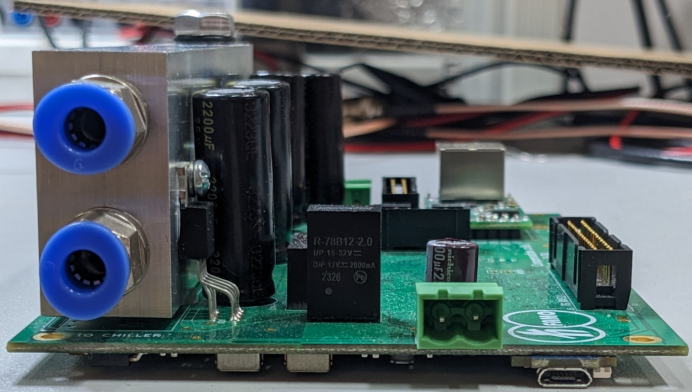

# current3x3A_Artiq
3 channel current driver (up to 3A each channel) compatible with Artiq




# Ports

Main power supply (- and +) 10A.

3x compensating coils.

Power supply for low power control circuits (optional). This power supplay can be taken from the main power supply (using jumpers).

Ethernet - user interface.

Water cooling.

# User Interface

The user interface is available via TCP/IP. TCP232 module is used for Ethernet TCP/IP communication. IP address is configurable on http server. After connecting to the device, the user can change settings by sending commands.

## Setting Ethernet
- type IP address in web browser (default-from factory TCP232 module IP is 192.168.0.7)
- switch to `Serial Port` tab and set `Work Mode` to `TCP Server` and `Local Port Number` which will be used to connect to device
- IP configuration may be changed in `Local IP Config` tab.

## Connecting to the device

Example in nc. In Windows you may need to switch to bash.
```
nc 192.168.3.96 10
```


## Commands

There are 3 ttl states available, s0 (ttl=000), s1 (ttl=001), s2 (ttl=010).

For each state, there are parameters: v1 (current in 1st coil), v2 (current in 2nd coil), v3 (current in 3th coil), t (time in ms of ramp before reaching these values). Current can be set between -3A to 3A. Minimum time t is 1ms.

Example:

`S1:V2 1.3` - set current 1.3A in 2nd coil for ttl state 001

`S0:V3 -0.23` - set current -0.23A in 3th coil for ttl state 000

`S2:T 5` - set time of ramp to 5 ms

`S1:V1 ?` - display value of 1st coil for state 001

`STATE ?` - display current ttl state 

# Issues

Please add your comments in the `Issues` Github section (at the top of this page).